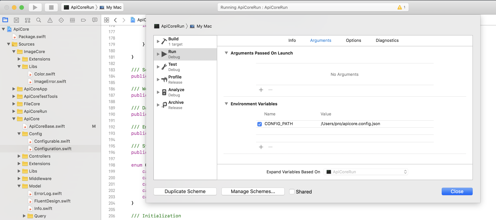

# Configuration

## Environmental variables & JSON config {#environmental-variables-and-json-config}

In your environmental variables you can optionally specify a path to your configuration JSON file. By default, system will be looking for `config.default.json` in the root of your project.

```text
CONFIG_PATH             // Path to your configuration file
```

Most simple way to configure the system is to set en anvironmental variable pointing to an `ApiCore` configuration file.

The JSON config may look something  like this:



```swift
{
	"server": {
		"name": "Booster!",
		"url": "http://localhost:8080",
		"max_upload": 50
	},
	"jwt_secret": "secret",
	"database": {
		"host": "localhost",
		"port": 5432,
		"user": "boost",
		"password": "aaaaaa",
		"database": "boost",
		"logging": true
	},
	"mail": {
		"mailgun": {
			"domain": "sandbox-domain.mailgun.org",
			"key": "secret-key"
		}
	}
}
```



ApiCore can be launched on it's own with a default configuration in which the database connections are pre-set to:

```text
apicore.database.host = localhost
apicore.database.port = 5432
apicore.database.name = boost
apicore.database.user = boost
apicore.database.password = aaaaaa
apicore.database.logging = false
```

> You can also combine the methods, have part in the config file and only override some properties using the ENV property approach \(described below\)

Comment for each value is:

```text
apicore.server.name                     - Name of the server
apicore.server.url                      - Client facing URL of the server, if not set, system will try to read X-Forwarded-Proto header (see Nginx, etc). Should even that be missing, http://localhost:8080 will be used. (optional)
apicore.server.max_upload_filesize      - Max file size to be uploaded onto the server as a Data file. (optional, default is 50Mb)

apicore.jwt_secret             - You have to set the secret to run Boost in production mode

apicore.mail.mailgun.domain    - Mailgun domain
apicore.mail.mailgun.key       - Mailgun API key

apicore.database.host          - Database host (optional, default localhost)
apicore.database.port          - Database port (optional, default 5432)
apicore.database.name          - Database name
apicore.database.user          - Login username
apicore.database.password      - Login password
apicore.database.logging       - Enable logging for your SQL queries (default false)

apicore.storage.local.root     - Path to the local file root

apicore.storage.s3.enabled           - Enable or disable S3 (local storage will be used if disabled) 
apicore.storage.s3.bucket            - Default S3 bucket (optional)
apicore.storage.s3.access_key        - S3 access key (optional)
apicore.storage.s3.secret_key        - S3 secret key (optional)
apicore.storage.s3.region            - S3 region (optional)
apicore.storage.s3.security_token    - S3 security token (optional)
```

#### Override default or config values with environmental variables

You can override any property in a default state or configured through a custom config json file using environmental variables.

The list of variables available reflects the paths in the `Configuration` object and can be either lowercased or uppercased based on the developers preference.

The order in which the system looks for the environmental properties is:

```text
1) apicore.jwt_secret
2) APICORE.JWT_SECRET
3) apicore_jwt_secret
4) APICORE_JWT_SECRET
```

**In Xcode the environmental variables can be set in the scheme settings**



